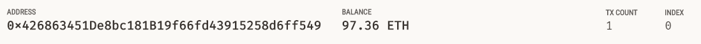
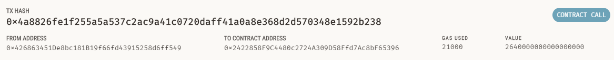

# Summary
For this project, I use two Python files, krypto_jobs.py and crypto_wallet.py, to automate the tasks of generating a digital wallet, accessing Ethereum account balances, and signing and sending transactions via a personal Ethereum blockchain called Ganache. The krypto_jobs.py file contains the code for the web interface of my application and the crypto_wallet.py file contains the Ethereum transaction functions.

I used Streamlit to build the web interface, through which a user can calculate the wage value of different professionals in order to send a transaction to pay the worker. To do this, the user will select a professional from the drop-down menu and then enter the numbr of hours for which they will hire the worker. The amount to be paid will be displayed in Ether, and the user will then be able to send an Ethereum transaction that pays the hired candidate. Once completed, the transaction hash will be displayed on the web interface. To ensure that this worked, I also ensured that the transaction was entered in Ganache, and the results are shown in the images below.

